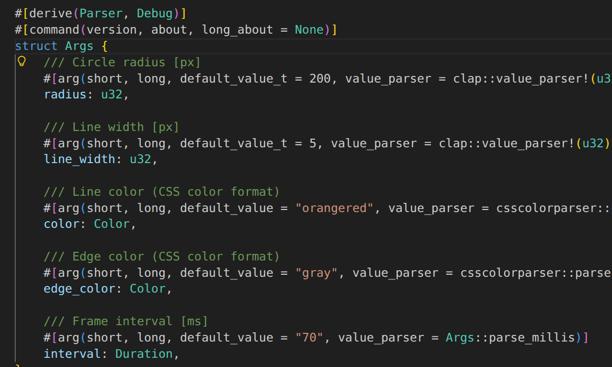

# Cursor-Beacon

A simple tool for highlighting the cursor position in X11 environments.



## Installation and Usage

`cursor-beacon` is written in Rust and available on crates.io.

You can install it using cargo:

```bash
cargo install cursor-beacon
```

Once installed, run the command:

```bash
cursor-beacon
```

**Recommended:** Assign a shortcut key to this command for easy access.
